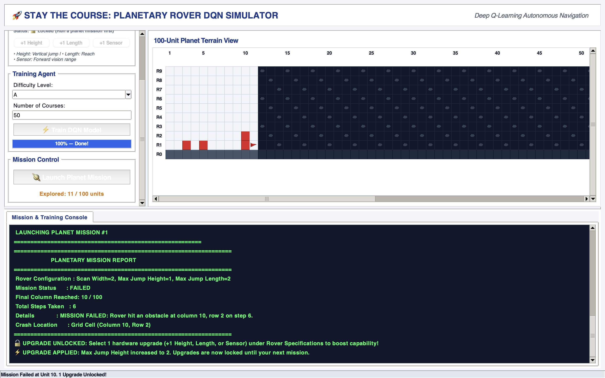

# Stay The Course (Part 1)
I simulated a quest to explore unknown terrain as a product testing problem for a rover. The rover is represented by a DQN model, and has a basic suite of capabilities (front sensor, jump height, jump length). The DQN can handle any level of the those capabilities. The user can train the rover and run missions, troubleshooting when missions fail. The simulation ends upon success or if the user chooses to exit. This is the first part in a series of projects building up to a full supply chain management scenario. 

## Overview
The object of the game is to explore the unknown terrain without crashing into any obstacles. When the simulation loads, the planet course is fixed. The user can train the rover on test courses of various difficulty levels (that mimic the style of obstacles on the planet). After each failed mission on the planet, the user has a chance to make an upgrade to the rover. 

The planet is a grid 10 units high and 100 units long. The rover initializes in the first column, second row (ground level) and decides to rove (move forward) or jump (move up and forward) at each time step. It chooses the height and length of the jump based on the sensor feedback (distance to next obstacle, height of that obstacle, width of that obstacle). 

When training the rover, the user can specify how many training courses the rover must complete (a proxy for the number of training steps, as the gradients are updated after each time step). They also select the difficulty of the courses. The training session records the percentage of perfect runs on the test set, and the average damage on the test set. The user can check the report to decide if more training is required or if the rover is ready for a mission.

There are two modes of gameplay available: console and GUI. 

## Approach
### Data Formulation
The input to the DQN is the scanner data (distance to next obstacle, height of that obstacle, width of that obstacle). The output is a choice: rove or jump. The exact specifications of those moves are determined by the scanner data, not chosen by the model. This prevents training instability (input and output dimensions are constant as the rover is upgraded). 

### Training & Evaluation
The DQN model is training by testing the rover on randomly generated training courses. Hitting an obstacle causes damage, a negative reward to the model. The train-validation-test split is 70-15-15. The user is given the training and validation loss curves in case of policy collapse, so they can make adjustments and retrain the model. Soft updates to the target network are used to prevent instability from the deadly triad in machine learning (bootstrapping, function approximation, off-policy learning). The DQN itself has linear layers with ReLU activation and one hidden layer. 

The model is evaluated on the test set after training. If at least 80% of the test runs complete without any damage, the user is advised to run a mission. Otherwise, they are advised to do more training or make adjustments. 

## GUI


## How To Use
### 1. Start the Simulation
Play an interactive CLI game against the trained Deep Q-Network (DQN) agent:

```bash
python3 simulation.py
```

### 2. Launch the GUI
Choose "Launch GUI" after starting the simulation or:

```bash
python3 gui.py
```

### 3. Troubleshooting
If you run into errors with the simulation and/or the GUI, make sure these files run without errors:

```bash
# Unittest suite for simulation
python3 test_simulation.py

# Diagnose training instability or gui loading errors
python3 train_diagnostic.py
python3 gui_troubleshoot.py
```
